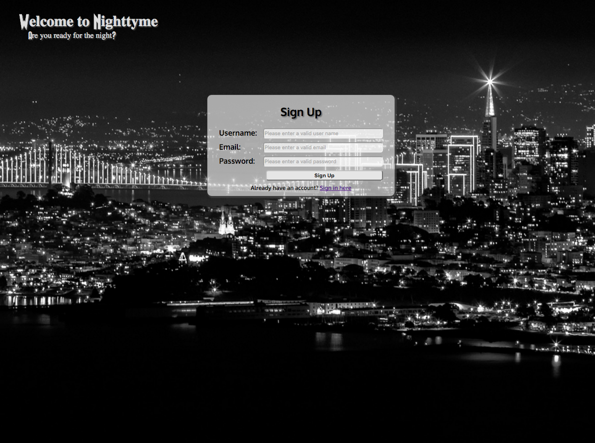
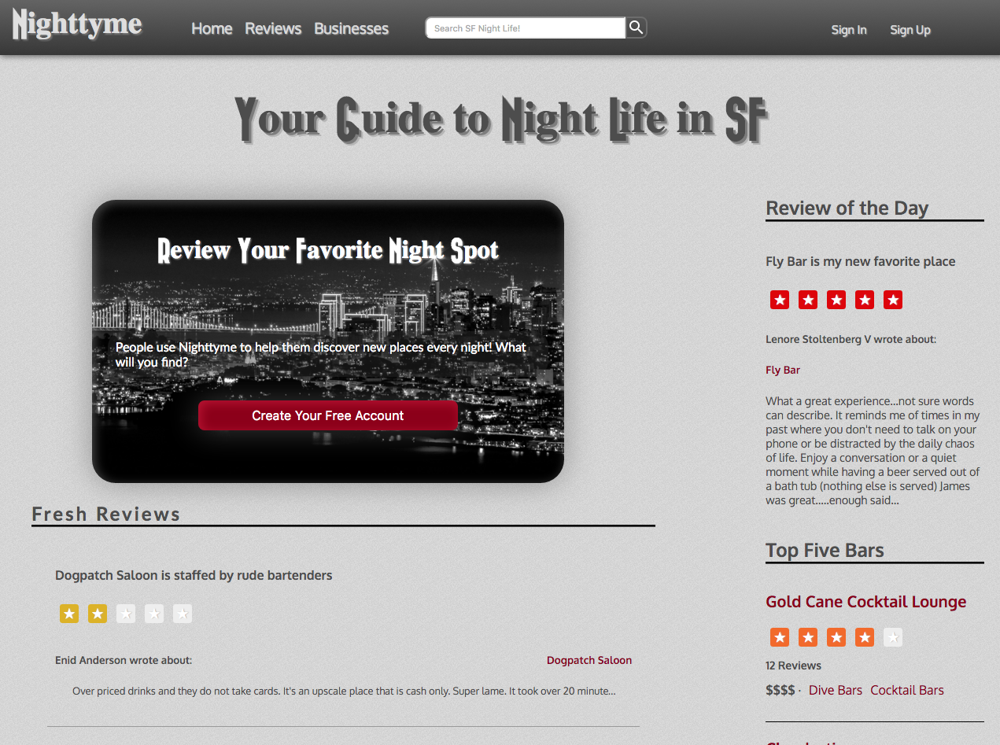
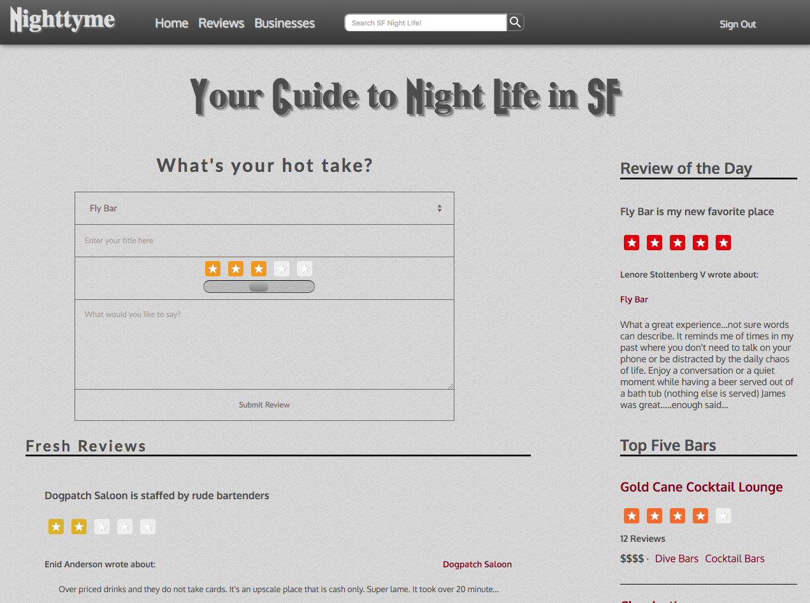
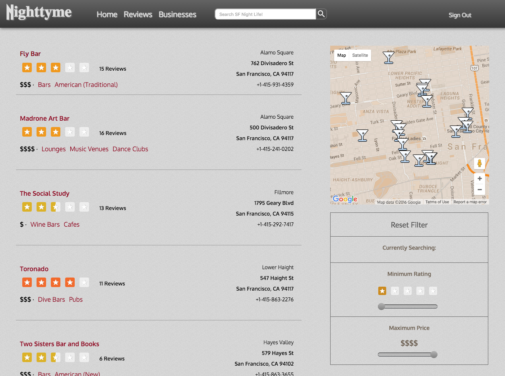
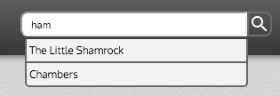
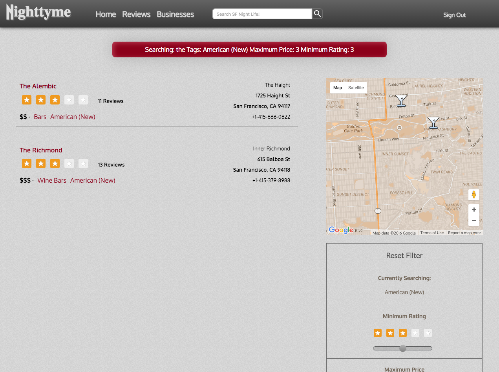
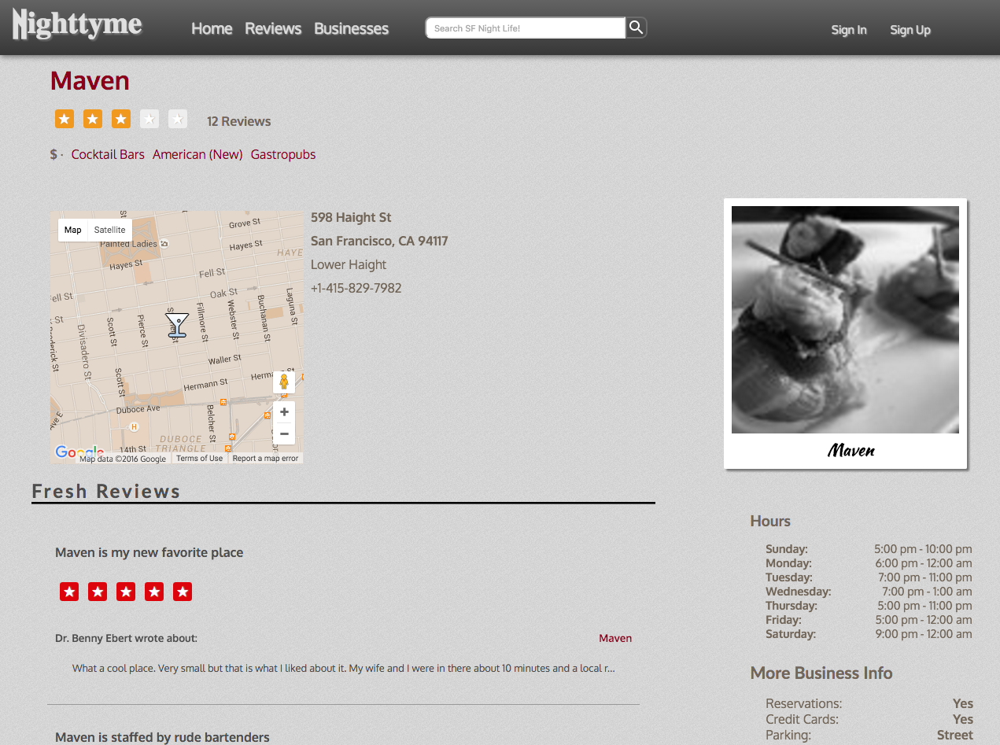
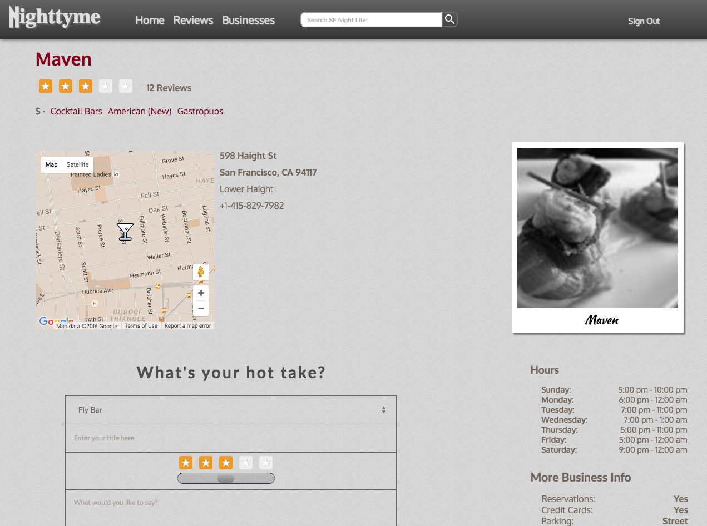

# Nighttyme

Nighttyme is a website inspire by [Yelp](http://www.yelp.com/) created by Brian Lambert.  It features almost 500 unique bars and clubs from around San Francisco, that users can search for or review.  Search criteria is feed through its own RESTful api and include name, geographic bounding box, minimum number of stars, maximum price, and tags, such as Pubs, Wine Bars, and Lounges among the 84 unique tags.

[Live here][live]

[live]: http://www.nighttyme.com/

## Features

* Authentication (for posting reviews)
  * Session is backend authenticated
  * Handrolled
  * Session information allows contextual page display
* Leave Reviews
  * Select a bar/club, provide title, stars (in half star increments), and a review body, and it will be attributed on the backend
  * Automatically updates stars and number of reviews for the review establishment
* Top Five Bars
  * Returns the five bars with highest aggregate reviews
  * Updates based upon changes to reviews
* Review of the Day
  * Returns a recent descriptive review
* Search Businesses
  * Search Bar && Filters
  * Search Bar
    * Queries the database and provides suggested links to the closest matching bar names
    * Can also be used a part of a larger query with the filters on the businesses page or link to that page with search term saved if not.
  * Filters
    * Filters by geographic bounding box based on the map, using the google maps api
    * Filters based on mimumium stars and maximum price
    * Filters on tags which are drawn from the yelp tags
* Seeded using real locations
  * Uses the Yelp api to generate seed data for almost 500 bars and clubs using real information
* Business Pages
  * Includes more specific information including hours, credit cards information, ambience, and happy hour information among other criteria
* Infinite Scroll
  * Both the reviews index and business index/search pages enable infinite scroll through custom pagination of api requests

## Code Guide

If you'd like to take a closer look at the code behind the Nighttyme App, the best folders to look in are:

* [Nighttyme.jsx](./frontend/Nighttyme.jsx)
* [React components](./frontend/components)
  * [App](./frontend/components/app.jsx)
* [Rails controllers](./app/controllers/api)
* [Flux Stores](./frontend/stores)
* [Api Util](./frontend/util/api_util.js)
* [DB Schema](./db/schema.rb)
* [Rails Routes](./config/routes.rb)

## Languages, Frameworks, Libraries, APIs, Etc.

* Ruby on Rails
* Ruby
* Postgres
* SQL
* React
* Flux
* jQuery
* JavaScript
* Gems
  * yelp
  * figaro
  * puma
  * bcrypt
  * pg

## Screenshots

Sign Up page:

Home page (logged out):

Home page (logged in):

Businesses Index:

Search Bar Suggestions:

Multiple Search Criteria:

Business Page (logged out):

Business Page (logged in):

